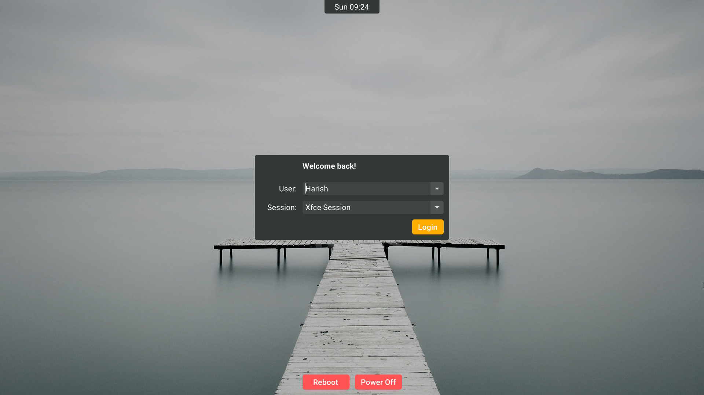

<!--
SPDX-FileCopyrightText: 2022 Harish Rajagopal <harish.rajagopals@gmail.com>

SPDX-License-Identifier: GPL-3.0-or-later
-->

<!--
SPDX-FileCopyrightText: 2021 Maximilian Moser <maximilian.moser@tuwien.ac.at>

SPDX-License-Identifier: MIT
-->

# ReGreet

A clean and customizable GTK-based [greetd](https://git.sr.ht/~kennylevinsen/greetd) greeter written in Rust using [Relm4](https://relm4.org/).
This is meant to be run under a Wayland compositor (like [Sway](https://github.com/swaywm/sway)).

It is based on [Max Moser's LightDM Elephant greeter](https://github.com/max-moser/lightdm-elephant-greeter), which is based on [Matt ~~Shultz's~~ Fischer's example LightDM greeter](https://web.archive.org/web/20210923235052/https://www.mattfischer.com/blog/archives/5).

## Screenshot


This uses the [Canta GTK theme](https://github.com/vinceliuice/Canta-theme) in dark mode with the Roboto font.

## Features
* Shows a dropdown list of existing users and X11/Wayland sessions
* Allows manual entry of username and session command
* Remembers the last authenticated user
* Automatically selects the last used session per user
* Supports customizing:
    - Background image
    - GTK theme
    - Dark mode
    - Cursor theme
    - Font

## Requirements
* Rust 1.64.0+ (for compilation only)
* greetd
* GTK 4.0+
* A Wayland compositor (such as [Cage](https://www.hjdskes.nl/projects/cage/) or [Sway](https://swaywm.org/))

**Note**: Please make sure you have all requirements installed, as having a greetd greeter constantly failing isn't as much fun as it sounds.

## Installation
### Arch Linux
ReGreet is available as [regreet-git](https://aur.archlinux.org/packages/regreet-git) in the AUR.
Install it either by cloning the AUR repository and running `makepkg`, or by using your favourite AUR helper:
```sh
paru -S regreet-git
```

### Manual
First, the greeter must be compiled using Cargo:
```sh
cargo build --release
```

The compilation process also configures the greeter to look for or use certain directories.
These can be changed by setting the values of certain environment variables.
These are:

Environment Variable | Default | Use
-- | -- | --
GREETD\_CONFIG\_DIR | `/etc/greetd` | The configuration directory used by greetd
CACHE\_DIR | `/var/cache/regreet` | The directory used to store cache
LOG\_DIR | `/var/log/regreet` | The directory used to store logs
SESSION\_DIR | `/usr/share/xsessions:/usr/share/wayland-sessions` | A colon (:) separated list of directories where the greeter looks for session files

The greeter can be installed by copying the file `target/release/regreet` to `/usr/bin` (or similar directories like `/bin`).

Optionally, to set up the log and cache directories using systemd-tmpfiles, do either of the following:
* Copy the configuration given in [systemd-tmpfiles.conf](./systemd-tmpfiles.conf) to `/etc/tmpfiles.d/regreet.conf` or `/usr/lib/tmpfiles.d/regreet.conf`.
* Run the `systemd-tmpfiles` CLI:
    ```sh
    systemd-tmpfiles --create "$PWD/systemd-tmpfiles.conf"
    ```

## Usage
### Set as Default Session
Edit the greetd config file (`/etc/greetd/config.toml`) to set regreet with a Wayland compositor as the default session.
For example, if using Cage:
```toml
[default_session]
command = "cage -s -- regreet"
user = "greeter"
```
The -s argument enables VT switching in cage (0.1.2 and newer only), which is highly recommended to prevent locking yourself out.

If using Sway, create a sway config file (in a path such as `/etc/greetd/sway-config`) as follows:
```
exec "regreet; swaymsg exit"
include /etc/sway/config.d/*
```

Then, set Sway to use this config (whose path is shown here as `/path/to/custom/sway/config`) as the default greetd session:
```toml
[default_session]
command = "sway --config /path/to/custom/sway/config"
user = "greeter"
```

Restart greetd to use the new config.

### Configuration
The configuration file must be named `regreet.toml`, and in the [TOML](https://toml.io/) format.
It should be located in the greetd configuration directory specified during compilation (`/etc/greetd/` by default).
A sample configuration is provided along with sample values for all available options in [`regreet.sample.toml`](regreet.sample.toml).

### Logging and Caching
The cache is are stored in `/var/cache/regreet/cache.toml` (configurable during installation).
It contains the last authenticated user and the last used session per user, which are automatically selected on next login.
If the greeter is unable to write to this file, then it reverts to the default behaviour.

The log file is stored in `/var/log/regreet/log` (configurable during installation).
Once the log file reaches a limit, it is compressed and rotated to `/var/log/regreet/log.X.gz`, where `X` is the index of the log file.
The higher the index, the older the log file.
After reaching a limit, the oldest log file is removed.
If the greeter is unable to write to this file or create files in the log directory, then it logs to stdout.

The recommended configuration is to run greetd greeters as a separate user (`greeter` in the above examples).
This can lead to insufficient permissions for either creating the cache/log directories, or writing to them.
To make use of the caching and logging features, please create the directories manually with the correct permissions, if not done during installation with systemd-tmpfiles.

## Licenses
This repository uses [REUSE](https://reuse.software/) to document licenses.
Each file either has a header containing copyright and license information, or has an entry in the [DEP5 file](https://www.debian.org/doc/packaging-manuals/copyright-format/1.0/) at [.reuse/dep5](./.reuse/dep5).
The license files that are used in this project can be found in the [LICENSES](./LICENSES) directory.

A copy of the GPL-3.0-or-later license is placed in [LICENSE](./LICENSE), to signify that it constitutes the majority of the codebase, and for compatibility with GitHub.
